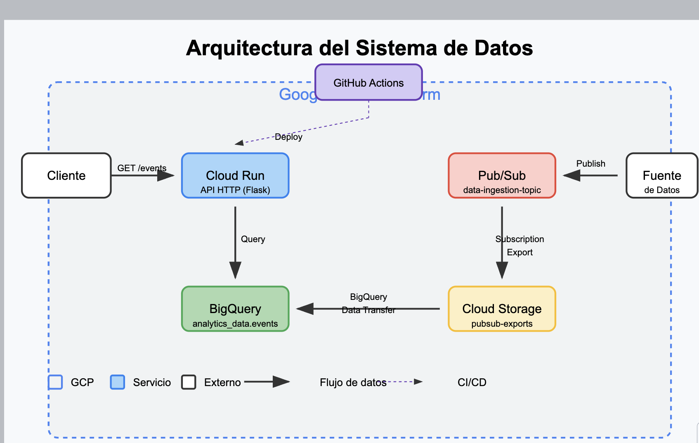
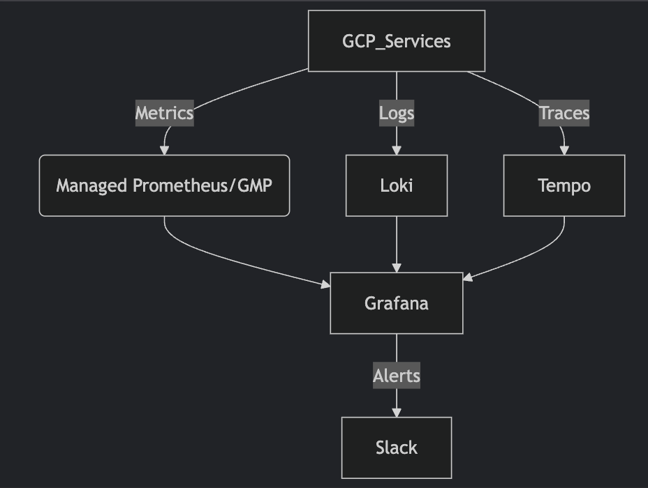

# Luis Hernandez Centti - SRE challenge

1) Pub/Sub (Ingesta de Datos)
2) Cloud Run (API)
3) BigQuery (Procesamiento)
4) Almacenamiento (Cloud Storage)

////////

Intrucciones de entrega.

curl -X POST https://advana-challenge-check-api-cr-k4hdbggvoq-uc.a.run.app/devops \
  -H "Content-Type: application/json" \
  -d '{
    "name": "Luis Hernandez",
    "mail": "luisangelo.hernandez@globant.com",
    "github_url": "https://github.com/luhercentti/challenge-sre"
  }'

gcloud projects add-iam-policy-binding lhc-demo-1 \
  --member="serviceAccount:terraform@lhc-demo-1.iam.gserviceaccount.com" \
  --role="roles/cloudbuild.builds.builder"

gcloud projects add-iam-policy-binding lhc-demo-1 \
  --member="serviceAccount:terraform@lhc-demo-1.iam.gserviceaccount.com" \
  --role="roles/run.admin"

gcloud projects add-iam-policy-binding lhc-demo-1 \
  --member="serviceAccount:terraform@lhc-demo-1.iam.gserviceaccount.com" \
  --role="roles/iam.serviceAccountUser"

para finops ver costs:
cd /infra
infracost breakdown --path=tfplan.json  

python -m venv challengelhc

source challengelhc/bin/activate

pip install google-cloud-pubsub
gcloud auth application-default login

python3 scripts/publish_test_events.py --project=lhc-demo-1

wait 15 minutes and then check cloud run url /events for samples

/////////

El sistema consta de los siguientes componentes:

Ingesta de Datos:

Pub/Sub recibe los datos
Una suscripción exporta automáticamente los mensajes a Cloud Storage
BigQuery Data Transfer importa los datos desde Cloud Storage a una tabla de BigQuery

API HTTP:

Una API REST implementada con Flask y ejecutada en Cloud Run
La API consulta los datos almacenados en BigQuery
Expone un endpoint GET /events que devuelve los datos en formato JSON

CI/CD:

GitHub Actions automatiza el despliegue
Construye y publica la imagen Docker a Google Container Registry
Aplica la infraestructura usando Terraform

////

Flujo de Datos End-to-End

Ingesta:

Los datos se publican en el tópico de Pub/Sub data-ingestion-topic
La suscripción export-to-storage exporta los mensajes automáticamente a Cloud Storage
El servicio de transferencia de BigQuery carga periódicamente los archivos desde Cloud Storage a la tabla analytics_data.events

Consulta:

El cliente hace una solicitud GET al endpoint /events de la API
La API de Cloud Run ejecuta una consulta a BigQuery para obtener los eventos más recientes
Los resultados se transforman y se devuelven como JSON al cliente

Implementación
El despliegue se realiza automáticamente cuando se hace push a las ramas main o develop:

GitHub Actions ejecuta el workflow de CI/CD
Se construye y publica la imagen Docker de la API
Terraform aplica la configuración de infraestructura
El sistema completo queda operativo

Pruebas
Para probar el sistema, puede:

Publicar eventos de prueba:
python scripts/publish_test_events.py --project YOUR_PROJECT_ID --topic data-ingestion-topic

Insertar datos directamente en BigQuery (para pruebas rápidas):
python scripts/insert_test_data.py --project YOUR_PROJECT_ID

Consultar la API:
bashcurl https://data-api-xxxxxxxxxxxx.run.app/events

///// 

Parte 3:
1. Proponer otras pruebas de integración que validen que el sistema está funcionando
correctamente y cómo se implementarían:
-Hay muchas formas de hacer esto, creando mas tests cases para cada componente del stack, por ejemplo creando un test a ver si se subio los json generados al bucket, o otro test a ver si los mensajes llegan a bigquery luego del tiempo de espoera 15 minutos, pruebas de escalabildiad de pub/sub, etc.

2. Identificar posibles puntos críticos del sistema (a nivel de fallo o performance)
diferentes al punto anterior y proponer formas de testearlos o medirlos (no
implementar)
- La transferencia desde PubSub a BigQuery mediante Storage no es instantánea (puede tomar de 15-30 minutos según la configuración), lo que hace que los datos no están disponibles inmediatamente para consulta en la API, o que se pierdan datos en caso de error durante la transferencia
- En cloud run sobre la api cloud run es autoescalable pero hay limites tambien en concurrencia. 
- Las consultas a BigQuery pueden ser costosas y lentas con grandes volúmenes de datos
- Posible throttling o timeout en consultas complejas
- Tambien pueden haber problemas si los json no se manejan correctamente por algun componente del stack.

3. Proponer cómo robustecer técnicamente el sistema para compensar o solucionar
dichos puntos críticos
- La transferencia de datos desde PubSub a BigQuery mediante el bucket de Storage puede tener latencia significativa, por eso se sugiere implementar un flujo alternativo directo con Dataflow.
- Dead Letter Queue (DLQ)(donde ven los mensajes no procesados correctamente, aislando errores) , y políticas de retry para manejo de errores.
- Para las limitaciones que pueda tener cloud run se sugiere usar un cache con Redis para optimizar consultas.
- Para la seguridad de cloud run podemos implementar api gateway que brinda opciones de seguridad como id tokens, y gestionar authentificacion como JWT, API keys, OAuth2) y aplicar políticas más granulares.

///////

Parte 4:

1. Proponer 3 métricas (además de las básicas CPU/RAM/DISK USAGE) críticas para
entender la salud y rendimiento del sistema end-to-end
- Latencia del pipeline de datos end to end. Medir el tiempo transcurrido desde que un mensaje se publica en Pub/Sub hasta que está disponible para consulta en BigQuery.
- Tasa de error en cada componente del sistema, Porcentaje de operaciones fallidas vs. total de operaciones en cada componente (Pub/Sub, Storage, BigQuery Transfer, API).
- Numero de mensajes procesados que fluyan por el stack hecho, para un mejor dimensionamiento y seteo de configuracion de infraestructura.

2. Proponer una herramienta de visualización y describe textualmente qué métricas
mostraría, y cómo esta información nos permitiría entender la salud del sistema para
tomar decisiones estratégicas
- La herramienta a usar por ser Google Cloud seria Google Cloud monitoring, crear un dashboard para cada componente(servicio) del stack. Mostraria metricas para cada servicio:
Pub/sub:  backlog, publish rate, latency, y mas
Bigquery: query execution time, data ingestion latency, failed queries, y mas
Cloud run: request lantency, count, error rate claro, cpu y memoria basicos, y mas
Cloud storage: bucket size, object count, error rates, transfer volume y mas.
Nos ayudaria a detectar cuellos de botella, dataflow latencia y errores, y uso de recursos.

3. Describe a grandes rasgos cómo sería la implementación de esta herramienta en la
nube y cómo esta recolectaría las métricas del sistema
- Los servicios ya exponen por defecto a cloud monitoring, entonces haria falta crear los dashboards, podemos usar monitoring como codigo para consitencia. 

4. Describe cómo cambiará la visualización si escalamos la solución a 50 sistemas
similares y qué otras métricas o formas de visualización nos permite desbloquear
este escalamiento.
- Camnbiariamos parametros de dashboasrds para usar vistas conjuntas o agregadas rapidamente.
- Agrupamiento en jerarquia para mayor granularidad.
- Heatmaps dashboard para ver rapidamente errores en alguna servicio del stack.

5. Comenta qué dificultades o limitaciones podrían surgir a nivel de observabilidad de
los sistemas de no abordarse correctamente el problema de escalabilidad
- Mucha data genera dashboards o queryes lentos, habria que optimizar queries.
- Yo sugeriria usar tambien servicios o softwware de observabilidad externos , como servidores o SaaS , de preferencia New relic que tiene todo build it y escalable, o si se quiere open source para observabilidad pues prometheus y grafana o ELK para logs centralizados.

  GCP_Logs --> Logstash --> Elasticsearch --> Kibana

o sino :

///////

Parte 5:

1. Define específicamente qué reglas o umbrales utilizarías para las métricas
propuestas, de manera que se disparan alertas al equipo al decaer la performance
del sistema. Argumenta.
- Para cada parte del stack:
pub/sub: backlog_messages, message_age, send_request_count
cloud run: request_latency, request_count(errores 5xx), container_memory_utilization o cpu usage.
BigQuery: query/execution_times, slots/utilization, jobs/failed, BigQuery Data Transfer Service fallos o errores.
cloud storage: request_count errores 5xx, storage/total_bytes execio un tamano establecido.
Son algunas metricas relevantes para ver que no afecten al usuario final.

2. Define métricas SLIs para los servicios del sistema y un SLO para cada uno de los
SLIs. Argumenta por qué escogiste esos SLIs/SLOs y por qué desechaste otras
métricas para utilizarlas dentro de la definición de SLIs.
- SLIS indica que debemos de medir porque es lo que percibe el usuario final. Como comentamos antes la lantencia y los mensajes que son exitosos o los fallidos son mediciones reales que afectaran al usuario.
- SLOS indicamos los valores correctos que obtenemos del analisis de los SLIS para definir valores de metricas correctas para un aceptable nivel de servicio.
Algunas metricas para SLIs, como ya mencionamos antes pueden ser:
SLI                                                                SLO
1. pub/sub
porcentaje de mensajes publciados en un rango de tiempo      -     cumplido porcentaje minimo requerido de mensages escritos en un rango de tiempo
mensajes existosos publicados                                -     99% mensual , perdida de tan solo 0.0.1%
2. API(cloud run)
total requests correctos 2xx mas 3xxx                        -    99.5% mensual (máximo 0.5% de errores)
tiempo de respuesta                                          -    95% de requests < 800ms. (ejemplo de umbrales)
3. Big query
exitosas / Total queries ejecutadas) * 100.                  -   99% mensual (1% de fallos tolerados).
rendimienteo de consultas Percentil (p90) del tiempo de ejecución. - 90% de queries < 15 segundos (ejemplo de limite)
4. Cloud storage
(Operaciones GET exitosas / Total operaciones GET) * 100.     - 99.9% mensual, servicio critico para la ingesta

- Se descartaron las metricas cpu ,memoria por ejemplo porque son metricas de capacidad no de calidad de servicio, y el usuario final realmente no ve estas metricas.

"SLI es el dato, SLO es la meta."
"Si el usuario no lo percibe, no es un SLI válido. Si no afecta el SLO, no merece una alerta crítica."

SLI es como el termómetro que mide la fiebre, y el SLO es como el diagnóstico ("si la fiebre > 38°C, hay problema").

///////
mejoras:

Solución propuesta: Implementar un flujo alternativo directo con Dataflow

La transferencia de datos desde PubSub a BigQuery mediante el bucket de Storage puede tener latencia significativa
Potencial pérdida de datos si hay problemas en algún punto del flujo

# Crear un job de Dataflow para streaming directo de Pub/Sub a BigQuery
resource "google_dataflow_job" "pubsub_to_bigquery" {
  name                  = "pubsub-to-bigquery-streaming"
  template_gcs_path     = "gs://dataflow-templates/latest/PubSub_to_BigQuery"
  temp_gcs_location     = "${google_storage_bucket.pubsub_export.url}/temp"
  service_account_email = google_service_account.bq_transfer_sa.email
  
  parameters = {
    inputTopic          = google_pubsub_topic.data_topic.id
    outputTableSpec     = "${var.gcp_project}:${google_bigquery_dataset.analytics.dataset_id}.${google_bigquery_table.events.table_id}"
    messageFormat       = "JSON"
  }
  
  depends_on = [
    google_project_service.required_apis,
    google_bigquery_table.events,
    google_pubsub_topic.data_topic
  ]
}